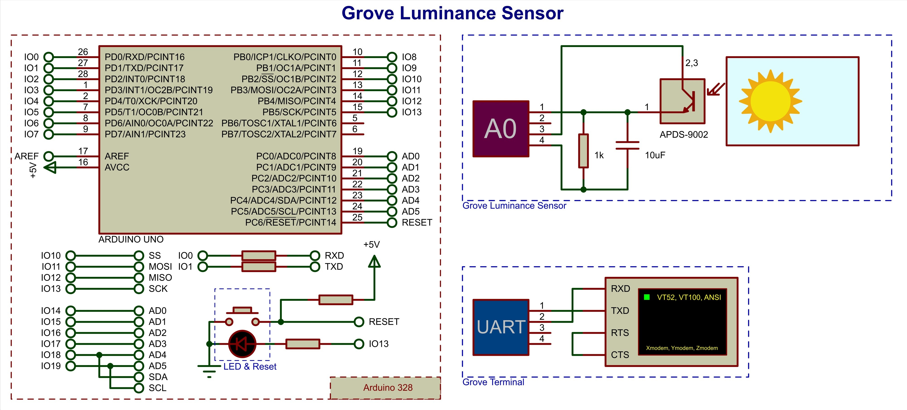
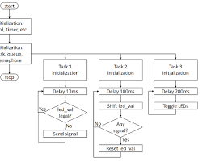
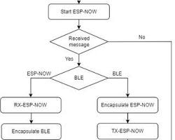

## สรุปเนื้อหาและสิ่งที่ควรจดเข้าห้องสอบ (Wk 9 - 12)
### 1. FreeRTOS (Week 12) 🚀 นี่คือหัวข้อที่สำคัญที่สุดและซับซ้อนที่สุด เน้น "โครงสร้าง" การสร้าง Task
---
## คอนเซปต์หลัก:

- ### Multitasking: ทำให้ ESP32 ทำงานหลายอย่าง "พร้อมกัน" (สลับไปมาเร็วๆ)

- ### Task: คือ "งาน" หรืองานย่อยๆ ที่ทำงานเป็นอิสระต่อกัน (เช่น Task A คุมไฟ, Task B อ่านเซ็นเซอร์)

## สิ่งที่ Task ต้องมี:

- ### ต้องเป็นฟังก์ชัน ```void TenTask(void *param)```

- ### ต้องมี Loop ```while(1)``` หรือ ```for(;;)```

- ### ต้องมี ```vTaskDelay()``` ข้างใน Loop (สำคัญมาก! ถ้าไม่มี Task อื่นจะไม่ได้ทำงาน)

- ### ``` vTaskDelay(pdMS_TO_TICKS(ms)): ``` คำสั่ง  Delay ของ FreeRTOS (ดีกว่า ```delay()```)

### เทมเพลตโค้ด (สำหรับสร้าง 2 Tasks)
```C

// 1. Task Function Prototypes (ประกาศฟังก์ชัน Task)
void Task1(void *param);
void Task2(void *param);

void setup() {
  Serial.begin(115200);

  // 3. Create Tasks (สร้าง Task)
  // xTaskCreate( FunctionName, "TaskName", StackSize, Parameters, Priority, TaskHandle );
  xTaskCreate(
    Task1,        // ฟังก์ชันของ Task
    "Task LED 1", // ชื่อ Task
    1024,         // Stack size (ขนาดหน่วยความจำ)
    NULL,         // Parameter ที่จะส่งไป (ไม่ใช้ใส่ NULL)
    1,            // Priority (ลำดับความสำคัญ)
    NULL);        // Task handle (ไม่ใช้ใส่ NULL)
  
  xTaskCreate(
    Task2,
    "Task Serial",
    1024,
    NULL,
    1,
    NULL);
}

// 2. Task Definitions (ตัวฟังก์ชัน Task)
void Task1(void *param) {
  // (Setup code for this task)
  pinMode(2, OUTPUT);

  for (;;) { // Loop ตลอดไป
    // (Work code for this task)
    digitalWrite(2, HIGH);
    vTaskDelay(pdMS_TO_TICKS(500)); // Delay 500ms
    digitalWrite(2, LOW);
    vTaskDelay(pdMS_TO_TICKS(500));
  }
}

void Task2(void *param) {
  for (;;) {
    Serial.println("Task 2 is running...");
    vTaskDelay(pdMS_TO_TICKS(2000)); // Delay 2000ms
  }
}

void loop() {
  // ว่างเปล่า! เพราะ FreeRTOS จัดการเองหมดแล้ว
}

```
---
## 2. ESPNOW (Weeks 9-11) 📡
- ### การสื่อสารไร้สายแบบ Peer-to-Peer (ไม่ต้องใช้ WiFi Router) ต้องมี 2 ฝั่ง: Sender และ Receiver

## คอนเซปต์หลัก:

- ### ใช้ MAC Address ในการระบุตัวตน (เหมือนเลขบัตรประชาชนของอุปกรณ์)

- ### ต้อง ```WiFi.mode(WIFI_STA)``` ก่อน

- ### ต้อง ```esp_now_init()```

- ### ต้องสร้าง ```struct``` (โครงสร้างข้อมูล) ให้เหมือนกันทั้ง 2 ฝั่ง

- ### Sender (ผู้ส่ง): ```ต้อง esp_now_add_peer()``` (เพิ่มเพื่อน) และใช้ ```esp_now_send()```

- ### Receiver (ผู้รับ): ต้อง ```esp_now_register_recv_cb()```(ลงทะเบียนฟังก์ชันรับข้อมูล)

## เทมเพลตโค้ด (Sender - ผู้ส่ง)

```C

#include <esp_now.h>
#include <WiFi.h>

// 1. MAC Address ของผู้รับ (เปลี่ยนเป็นของผู้รับ)
uint8_t receiverMac[] = {0xAA, 0xBB, 0xCC, 0xDD, 0xEE, 0xFF};

// 2. Struct (ต้องเหมือนกับฝั่งรับ)
typedef struct struct_message {
  int id;
  float temp;
} struct_message;

struct_message myData; // สร้างตัวแปรจาก struct

esp_now_peer_info_t peerInfo; // ข้อมูลของ "เพื่อน"

// 4. Callback function เมื่อส่งข้อมูลเสร็จ
void OnDataSent(const uint8_t *mac_addr, esp_now_send_status_t status) {
  Serial.print("Send status: ");
  Serial.println(status == ESP_NOW_SEND_SUCCESS ? "Success" : "Fail");
}

void setup() {
  Serial.begin(115200);
  WiFi.mode(WIFI_STA); // ตั้งโหมด STA

  if (esp_now_init() != ESP_OK) {
    Serial.println("Error initializing ESP-NOW");
    return;
  }

  // 3. ลงทะเบียน Callback "ส่ง"
  esp_now_register_send_cb(OnDataSent);

  // 5. เพิ่มเพื่อน (Add Peer)
  memcpy(peerInfo.peer_addr, receiverMac, 6);
  peerInfo.channel = 0;
  peerInfo.encrypt = false;
  
  if (esp_now_add_peer(&peerInfo) != ESP_OK) {
    Serial.println("Failed to add peer");
    return;
  }
}

void loop() {
  // 6. เตรียมข้อมูลและส่ง
  myData.id = 123;
  myData.temp = 25.5;
  
  esp_err_t result = esp_now_send(receiverMac, (uint8_t *) &myData, sizeof(myData));
  
  delay(5000); // ส่งทุก 5 วินาที
}

```
## เทมเพลตโค้ด (Receiver - ผู้รับ)

```C

#include <esp_now.h>
#include <WiFi.h>

// 1. Struct (ต้องเหมือนกับฝั่งส่ง)
typedef struct struct_message {
  int id;
  float temp;
} struct_message;

struct_message myData; // สร้างตัวแปรจาก struct

// 3. Callback function เมื่อได้รับข้อมูล (หัวใจหลัก)
void OnDataRecv(const uint8_t *mac, const uint8_t *incomingData, int len) {
  memcpy(&myData, incomingData, sizeof(myData)); // คัดลอกข้อมูลที่มาใส่ตัวแปร
  Serial.print("Data received: ");
  Serial.print("ID: ");
  Serial.println(myData.id);
  Serial.print("Temp: ");
  Serial.println(myData.temp);
}
 s
void setup() {
  Serial.begin(115200);
  WiFi.mode(WIFI_STA); // ตั้งโหมด STA

  if (esp_now_init() != ESP_OK) {
    Serial.println("Error initializing ESP-NOW");
    return;
  }

  // 2. ลงทะเบียน Callback "รับ" (สำคัญที่สุด)
  esp_now_register_recv_cb(OnDataRecv);
}

void loop() {
  // ว่างเปล่า! เพราะการทำงานทั้งหมดเกิดใน Callback (OnDataRecv)
}
```

## 3. MQTT (Weeks 9-11) 📬
- ### การสื่อสารแบบ Publish/Subscribe (ต้องใช้ WiFi และ Broker)

## คอนเซปต์หลัก:

- ### Broker: ตัวกลาง (เช่น ```broker.hivemq.com```)

- ### Publish (Pub): การ "ส่ง" ข้อมูลไปยัง "หัวข้อ" (Topic)

- ### Subscribe (Sub): การ "ขอรับ" ข้อมูลจาก "หัวข้อ" (Topic)

- ### Callback: ฟังก์ชันที่จะทำงานเมื่อมีข้อความเข้ามาใน Topic ที่เรา Sub อยู่

- ### ```client.loop():``` สำคัญมาก! ต้องเรียกใน ```loop()``` ตลอดเวลา เพื่อให้ MQTT ทำงาน

## เทมเพลตโค้ด (Pub & Sub)

```C

#include <WiFi.h>
#include <PubSubClient.h>

// 1. WiFi & MQTT Config
const char* ssid = "YOUR_SSID";
const char* password = "YOUR_PASSWORD";
const char* mqtt_server = "broker.hivemq.com"; // Broker

WiFiClient espClient;
PubSubClient client(espClient);

// 5. Callback function เมื่อได้รับข้อความ (สำหรับ Sub)
void callback(char* topic, byte* payload, unsigned int length) {
  Serial.print("Message arrived [");
  Serial.print(topic);
  Serial.print("] ");
  payload[length] = '\0'; // ปิดท้าย String
  String message = (char*)payload;
  Serial.println(message);

  // สั่งงานจากข้อความที่ได้รับ
  if (message == "ON") {
    digitalWrite(2, HIGH);
  } else if (message == "OFF") {
    digitalWrite(2, LOW);
  }
}

// 4. Reconnect Function (เชื่อมต่อ WiFi และ MQTT)
void reconnect() {
  while (!client.connected()) { // วนจนกว่าจะเชื่อมต่อได้
    Serial.print("Attempting MQTT connection...");
    // Create a random client ID
    String clientId = "ESP32Client-";
    clientId += String(random(0xffff), HEX);
    
    if (client.connect(clientId.c_str())) {
      Serial.println("connected");
      // 4.1 Publish เมื่อเชื่อมต่อ (ถ้าต้องการ)
      client.publish("my/test/topic", "Hello from ESP32");
      // 4.2 Subscribe Topic ที่ต้องการ
      client.subscribe("my/control/topic"); 
    } else {
      Serial.print("failed, rc=");
      Serial.print(client.state());
      Serial.println(" try again in 5 seconds");
      delay(5000);
    }
  }
}

void setup() {
  pinMode(2, OUTPUT);
  Serial.begin(115200);

  // 2. Connect to WiFi
  Serial.print("Connecting to ");
  Serial.println(ssid);
  WiFi.begin(ssid, password);
  while (WiFi.status() != WL_CONNECTED) {
    delay(500);
    Serial.print(".");
  }
  Serial.println("\nWiFi connected");

  // 3. Setup MQTT
  client.setServer(mqtt_server, 1883); // ตั้งค่า Broker
  client.setCallback(callback); // ตั้งค่า Callback (สำหรับ Sub)
}

void loop() {
  // 6. Check Connection (สำคัญมาก!)
  if (!client.connected()) {
    reconnect();
  }
  client.loop(); // (สำคัญมาก!)

  // 7. Publish (ตัวอย่างการส่งค่าทุก 5 วิ)
  static long lastMsg = 0;
  long now = millis();
  if (now - lastMsg > 5000) {
    lastMsg = now;
    
    float temp = 25.7; // สมมติค่า
    char msg[50];
    sprintf(msg, "Temperature: %.2f", temp); // แปลง float เป็น string
    
    Serial.print("Publish message: ");
    Serial.println(msg);
    client.publish("my/sensor/topic", msg);
  }
}
```

## 4. ฟังก์ชัน/คำสั่ง C ที่น่าจดจำ (Misc)
- ### แปลง Float เป็น String (สำหรับ MQTT):

```C

float f = 25.123;
char buffer[10];
dtostrf(f, 4, 2, buffer); // (ตัวแปร, ความกว้างรวม, ทศนิยม, ที่เก็บ) -> "25.12"
// หรือ
sprintf(buffer, "%.2f", f);
```
- ### การใช้ Struct (สำหรับ ESPNOW):

```C

typedef struct my_struct {
  int a;
  float b;
  char c[10];
} my_struct;

my_struct data_to_send;
data_to_send.a = 10;
data_to_send.b = 1.23;
strcpy(data_to_send.c, "Hello");
```

- ### การ Copy Struct (สำหรับ ESPNOW):

```C

// (ใน OnDataRecv)
my_struct received_data;
memcpy(&received_data, incomingData, sizeof(received_data));
// ตอนนี้ received_data.a, .b, .c มีค่าที่ส่งมาแล้ว
```

- ### หา MAC Address ของตัวเอง (สำหรับ ESPNOW):

```C

// (ใน setup)
Serial.print("My MAC Address: ");
Serial.println(WiFi.macAddress());
```


## 5. พื้นฐาน Hardware (สำหรับ Wk 9-12)
- ## 5.1 การอ่านสวิตช์ (GPIO - Digital Input) 🔘
- ### ใช้สำหรับรับคำสั่ง "กด" เพื่อไปสั่งงาน ESPNOW หรือ Task อื่น คอนเซปต์: ใช้ INPUT_PULLUP เพื่อให้ ESP32 จ่ายไฟเลี้ยงให้ปุ่ม (Active LOW) ไม่ต้องต่อ R ภายนอก



---

- ### เทมเพลตโค้ด (Internal Pull-up):

```C
#define BUTTON_PIN 15 // สมมติใช้ Pin 15

void setup() {
  pinMode(BUTTON_PIN, INPUT_PULLUP);
}

void loop() {
  // อ่านค่าปุ่ม
  // HIGH (1) = ไม่ได้กด (เพราะ PULLUP)
  // LOW (0)  = กด
  if (digitalRead(BUTTON_PIN) == LOW) {
    // ปุ่มถูกกด
    Serial.println("Button Pressed!");
    delay(50); // กันปุ่มสั่น (Debounce)
  }
}

// **การประยุกต์ใช้ในข้อสอบ:**
// เอาเงื่อนไข if (digitalRead(...) == LOW)
// ไปไว้ใน loop() ของ Sender เพื่อสั่ง esp_now_send()
// หรือไปไว้ใน Task ของ FreeRTOS เพื่อเช็คปุ่ม
```

- ## 5.2 การอ่านค่า Analog (ADC) / LDR ☀️
- ### ใช้สำหรับอ่านค่าเซ็นเซอร์ที่เป็น Analog (เช่น LDR, ตัวต้านทานปรับค่าได้) เพื่อส่งค่าผ่าน ESPNOW หรือ MQTT คอนเซปต์ LDR: LDR (Light Dependent Resistor)

- ### สว่างมาก -> ความต้านทานต่ำ

- ### มืดมาก -> ความต้านทานสูง การต่อวงจร: ต้องต่อแบบ Voltage Divider (แบ่งแรงดัน) เพื่อแปลง "ความต้านทาน" เป็น "แรงดัน" ให้ ESP32 อ่านได้

.jpg>)

- ### เทมเพลตโค้ด (อ่านค่า LDR/ADC):

```C
#define LDR_PIN 34 // สมมติใช้ Pin 34 (เป็น ADC Pin)

void setup() {
  Serial.begin(115200);
}

void loop() {
  // อ่านค่า Analog (ESP32 มี 12-bit ADC)
  int sensorValue = analogRead(LDR_PIN);
  // ค่าที่ได้จะอยู่ระหว่าง 0 (0V) ถึง 4095 (3.3V)

  Serial.print("Analog Value: ");
  Serial.println(sensorValue);

  // (Optional) ถ้าต้องแปลงเป็น Voltage
  // float voltage = sensorValue * (3.3 / 4095.0);

  delay(1000);
}

// **การประยุกต์ใช้ในข้อสอบ:**
// เอา int sensorValue = analogRead(LDR_PIN);
// ไปไว้ใน loop() ของ Sender เพื่อยัดค่าใส่ struct myData.temp = sensorValue;
// หรือไปไว้ใน Task ของ FreeRTOS เพื่ออ่านค่าทุก 1 วินาที
```

## 6. Flowchart: ESPNOW (Receiver - ผู้รับ)

.jpg>)

## คำอธิบายประกอบ:

- ### Setup: ทำแค่ 2 อย่างคือ Init และ Register Callback "OnDataRecv"

- ### Loop: มักจะ "ว่างเปล่า" (Idle) เพราะการทำงานทั้งหมดจะเกิดขึ้นใน Callback

- ### OnDataRecv (Callback): นี่คือหัวใจหลัก "ถูกเรียกอัตโนมัติ" เมื่อมีข้อมูลใหม่เข้ามา โค้ดที่ใช้จัดการข้อมูล (เช่น memcpy) จะอยู่ในนี้

## 6.1 Flowchart: การอ่านค่า Analog/Button (พื้นฐาน)
- ### Flowchart พื้นฐานที่สุด สำหรับการอ่านค่าจากเซ็นเซอร์ (ADC) หรือปุ่ม (GPIO) เพื่อเอาไปประยุกต์ใช้

.jpg>)

## 6.2 Flowchart: การทำงานของ FreeRTOS (2 Tasks)

## คำอธิบายประกอบ:

- ### Setup: ทำงานแค่ครั้งเดียวเพื่อ "สร้าง" Task ทั้งสอง

- ### Scheduler: คือตัวจัดการของ FreeRTOS ที่จะคอยสลับการทำงานระหว่าง Task 1 และ Task 2

- ### Task Loop: แต่ละ Task จะมี Loop while(1) ของตัวเอง และจะ "คืน" การควบคุมให้ Scheduler เมื่อเจอ vTaskDelay()

## 6.3 Flowchart: ESPNOW (Sender - ผู้ส่ง)


## คำอธิบายประกอบ:

- ### Setup: คือส่วนที่ยุ่งที่สุด ต้อง Init, Add Peer, และ Register Callback "OnDataSent"

- ### Loop: คือส่วนที่ทำงานจริง คอยวนลูปเพื่อเตรียมข้อมูล (เช่น อ่านค่า LDR) แล้วสั่ง esp_now_send()

- ### OnDataSent (Callback): เป็นฟังก์ชันที่ "ถูกเรียกอัตโนมัติ" หลังจาก ส่งเสร็จ เพื่อแจ้งว่าผลการส่งสำเร็จหรือล้มเหลว

## 7 Simple Web Server (อีกหนึ่ง Application Wk 9-11)

- ### ถ้าข้อสอบไม่ออก MQTT แต่อยากให้ ESP32 สื่อสารผ่าน WiFi นี่คืออีกหนึ่งตัวเต็งครับ คือการเปลี่ยน ESP32 ให้เป็น "เว็บเซิร์ฟเวอร์" เพื่อสั่งงานผ่าน Browser (เช่น คุมไฟ)

- ### เทมเพลตโค้ด (Web Server ควบคุม LED):

```C
#include <WiFi.h>

// 1. WiFi Config
const char* ssid = "YOUR_SSID";
const char* password = "YOUR_PASSWORD";

WiFiServer server(80); // สร้าง Server ที่ Port 80

#define LED_PIN 2 // LED ที่จะคุม

void setup() {
  Serial.begin(115200);
  pinMode(LED_PIN, OUTPUT);
  digitalWrite(LED_PIN, LOW);

  // 2. Connect to WiFi
  Serial.print("Connecting to ");
  Serial.println(ssid);
  WiFi.begin(ssid, password);
  while (WiFi.status() != WL_CONNECTED) {
    delay(500);
    Serial.print(".");
  }
  Serial.println("\nWiFi connected");
  Serial.println("IP address: ");
  Serial.println(WiFi.localIP()); // *ต้องจด IP นี้ไปเปิดใน Browser*

  server.begin(); // 3. Start Server
}

void loop() {
  WiFiClient client = server.available(); // 4. รอ Client (Browser) ต่อเข้ามา

  if (client) {
    Serial.println("New Client.");
    String currentLine = "";
    while (client.connected()) {
      if (client.available()) {
        char c = client.read();
        Serial.write(c);
        if (c == '\n') {
          if (currentLine.length() == 0) {
            // 6. ส่งหน้าเว็บ (HTML) กลับไป
            client.println("HTTP/1.1 200 OK");
            client.println("Content-type:text/html");
            client.println();
            
            // UI ของเว็บ
            client.println("<html><body><h1>ESP32 Web Server</h1>");
            client.println("<p><a href=\"/on\"><button>Turn ON</button></a></p>");
            client.println("<p><a href=\"/off\"><button>Turn OFF</button></a></p>");
            client.println("</body></html>");
            client.println();
            break;
          } else {
            currentLine = "";
          }
        } else if (c != '\r') {
          currentLine += c;
        }

        // 5. ตรวจสอบ Request ที่ส่งมา
        if (currentLine.endsWith("GET /on")) {
          digitalWrite(LED_PIN, HIGH);
          Serial.println("LED ON");
        }
        if (currentLine.endsWith("GET /off")) {
          digitalWrite(LED_PIN, LOW);
          Serial.println("LED OFF");
        }
      }
    }
    client.stop(); // จบการเชื่อมต่อ
    Serial.println("Client Disconnected.");
  }
}
```
## 8. การจัดรูปแบบข้อมูล (JSON)

- ### ไม่ว่าจะเป็น ESPNOW หรือ MQTT การส่งข้อมูลหลายๆ ค่า (เช่น ID, Temp, Humidity) ในครั้งเดียว ควรใช้ JSON นี่คือวิธีทำที่ "ถูกต้อง" ที่สุด (ดีกว่า ```sprintf```)

- ### ต้องใช้ Library: ```ArduinoJson.h```

- ### เทมเพลตโค้ด (สร้าง JSON เพื่อส่ง)

```C
#include <ArduinoJson.h>

// สร้าง JSON
StaticJsonDocument<200> doc; // 200 คือขนาด (เผื่อไว้)

// 1. ใส่ข้อมูล
doc["id"] = 101;
doc["sensor"] = "LDR";
doc["value"] = analogRead(34);

// 2. แปลงเป็น String
char jsonOutput[128];
serializeJson(doc, jsonOutput);

// 3. ส่ง String นี้ไปทาง MQTT หรือ ESPNOW
// client.publish("my/topic", jsonOutput);
// หรือ esp_now_send(... (uint8_t*)jsonOutput, strlen(jsonOutput));
Serial.println(jsonOutput); 
// ผลลัพธ์: {"id":101,"sensor":"LDR","value":1234}
```

- ### เทมเพลตโค้ด (อ่าน JSON ที่ได้รับมา)

```C
// (สมมติได้รับ String ชื่อ incomingMessage)
// char* incomingMessage = "{\"id\":101,\"value\":1234}";

StaticJsonDocument<200> doc;

// 1. อ่าน String (Deserialize)
DeserializationError error = deserializeJson(doc, incomingMessage);

if (error) {
  Serial.print("deserializeJson() failed: ");
  Serial.println(error.c_str());
  return;
}

// 2. ดึงค่าออกมาใช้
int id = doc["id"]; // 101
int val = doc["value"]; // 1234

Serial.print("ID: "); Serial.println(id);
Serial.print("Value: "); Serial.println(val);
```
## 9.FreeRTOS (ส่วนทฤษฎีกันเหนียว)

### ถ้าข้อสอบถามทฤษฎีว่า "ถ้า Task 2 ตัวต้อง รอ กัน หรือ ส่งข้อมูล หากัน" จะใช้อะไร?

- ### Queue (คิว):

    - ### ใช้ทำไม: สำหรับ "ส่งข้อมูล" ระหว่าง Task

    - ### ตัวอย่าง: Task A อ่านค่า LDR แล้ว "ส่งค่า" (ใส่คิว) ไปให้ Task B เอาไปคำนวณ

- ### Semaphore (เซมาฟอร์):

    - ### ใช้ทำไม: สำหรับ "ส่งสัญญาณ" (บอกว่าเสร็จแล้ว) หรือ "จองทรัพยากร" (กันใช้พร้อมกัน)

     - ### ตัวอย่าง: Task A ต้องรอ Task B ทำงานให้เสร็จก่อน Task B ก็จะ "ให้สัญญาณ" (Give Semaphore) เมื่อทำเสร็จ Task A ที่ "รอ" (Take Semaphore) อยู่ก็จะทำงานต่อได้

## 10. Timer Interrupts (ขั้นสูง)
### ถ้าโจทย์ต้องการความแม่นยำของเวลามากๆ (ที่ ```vTaskDelay``` อาจไม่พอ) หรืออยากให้มีงานแทรกด่วนๆ นี่คือโค้ด "กันตาย"

```C
hw_timer_t *timer = NULL; // สร้างตัวแปร Timer

// ฟังก์ชันที่จะถูกเรียก "อัตโนมัติ" เมื่อ Timer นับครบ
void IRAM_ATTR onTimer() {
  // **ห้าม** ใส่ Serial.print() หรือ delay() ในนี้!
  // ให้ทำอะไรง่ายๆ เร็วๆ เช่น
  digitalWrite(2, !digitalRead(2)); // สลับสถานะไฟ
}

void setup() {
  pinMode(2, OUTPUT);
  
  // 1. สร้าง Timer (ใช้ Timer 0, Prescaler 80)
  // (80 MHz / 80 = 1,000,000 ticks/sec)
  timer = timerBegin(0, 80, true); 
  
  // 2. ผูก Timer กับฟังก์ชัน (Attach Interrupt)
  timerAttachInterrupt(timer, &onTimer, true); 
  
  // 3. ตั้งเวลา (1,000,000 ticks = 1 วินาที)
  // ให้ Interrupt ทำงานทุก 1 วินาที
  timerAlarmWrite(timer, 1000000, true); // true = นับวน
  
  // 4. สั่งเริ่มนับ
  timerAlarmEnable(timer); 
}

void loop() {
  // ว่างๆ ได้เลย หรือทำงานอื่นไป
}
```

### GPIO ย่อมาจาก General Purpose Input/Output ครับ

- ### G = General Purpose (อเนกประสงค์)

- ### P = Purpose (วัตถุประสงค์)

- ### I = Input (รับข้อมูล)

- ### O = Output (ส่งข้อมูล)

### เราสามารถเขียนโปรแกรมสั่งให้ขา GPIO ใดๆ ทำหน้าที่เป็น:

- ### Input (อินพุต): เพื่อ "อ่าน" ค่าจากโลกภายนอก เช่น อ่านสถานะสวิตช์ (ว่าถูกกดหรือไม่) หรืออ่านค่าจากเซ็นเซอร์ 🔘

- ### Output (เอาต์พุต): เพื่อ "ส่ง" สัญญาณไปควบคุมโลกภายนอก เช่น สั่งให้ไฟ LED ติดหรือดับ หรือสั่งให้มอเตอร์หมุน 💡

### คำตอบง่ายๆ คือ "เพราะข้างในชิป มันมีสวิตช์อิเล็กทรอนิกส์ที่ซับซ้อนครับ"

- ### ขา GPIO หนึ่งขา ไม่ได้เป็นแค่ "เส้นลวด" ต่อตรงไปยัง CPU ครับ แต่มันเชื่อมต่อกับ "วงจร" ที่สามารถ "สลับโหมด" การทำงานได้ เรามาดูว่า 2 โหมดนี้ทำงานต่างกันยังไง:
---

- ### 1. โหมด OUTPUT (โหมดสั่งการ / "เครื่องสูบน้ำ") 💧
    - ### เมื่อคุณสั่ง ```pinMode(pin, OUTPUT):```

    - ### คุณกำลังสั่งให้ ESP32 ต่อขานี้เข้ากับ "เครื่องสูบน้ำ" (วงจรขับกระแส หรือ Push-Pull Driver) ภายในชิป

    - ### เมื่อสั่ง ```digitalWrite(pin, HIGH):``` ชิปจะเปิด "ปั๊มน้ำ" ที่ต่อกับ ไฟเลี้ยง (3.3V) อัดแรงดันไฟ 3.3V ออกไปที่ขานี้ทันที (เพื่อสั่งให้ LED ติด)

    - ### เมื่อสั่ง ```digitalWrite(pin, LOW):``` ชิปจะสลับไปเปิด "ปั๊ม" ที่ต่อกับ กราวด์ (0V) ดูดแรงดันไฟที่ขานี้ลง 0V ทันที (เพื่อสั่งให้ LED ดับ)

- ### ในโหมดนี้ ขา GPIO จะ "คุมเกม" 100% มันเป็นตัวที่ สร้าง สัญญาณไฟขึ้นมาเองครับ
---
- ### 2. โหมด INPUT (โหมดรับฟัง / "เซ็นเซอร์") 🎧
    - ###  เมื่อคุณสั่ง ```pinMode(pin, INPUT):```

    - ### คุณกำลังสั่งให้ ESP32 "ตัดการเชื่อมต่อ" ขานี้ออกจาก "เครื่องสูบน้ำ" (วงจร Output) ทั้งหมด

    - ### แล้วสลับไปต่อกับ "เซ็นเซอร์วัดแรงดัน" (วงจรรับสัญญาณ หรือ Input Buffer) ที่ไวมากแทน

    - ### เมื่อสั่ง ```digitalRead(pin):``` คุณกำลัง "อ่านค่า" จากเซ็นเซอร์นี้ว่า "ตอนนี้แรงดันไฟที่ขา มีค่าใกล้ 3.3V (HIGH) หรือใกล้ 0V (LOW)?"

- ### ในโหมดนี้ ขา GPIO จะเป็น "ผู้ฟัง" ที่ดี มันจะไม่พยายามสร้างสัญญาณไฟใดๆ ออกไปรบกวนวงจรภายนอกเลย มันแค่คอย "ฟัง" ว่าคนอื่นส่งอะไรมา
---
- ### สรุป "ทำยังไง"
- ### ```pinMode()``` คือคำสั่งที่ใช้ "สับสวิตช์"

    - ### ```pinMode(pin, OUTPUT):``` สับสวิตช์ไปที่วงจร "เครื่องสูบน้ำ" (Push-Pull Driver)

    - ### ```pinMode(pin, INPUT):``` สับสวิตช์ไปที่วงจร "เซ็นเซอร์" (Input Buffer)

- ### วงจรสลับโหมดอัจฉริยะนี้เรียกว่า Tri-State Buffer ครับ เพราะมันมี 3 สถานะ:

    - ### HIGH (ต่อกับ 3.3V)

    - ### LOW (ต่อกับ 0V)

    - ### High-Impedance หรือ Hi-Z (สถานะที่ 3) - นี่คือโหมด INPUT ที่ตัดการเชื่อมต่อทุกอย่างออกหมด เหลือแต่ "เซ็นเซอร์" ครับ

#

### 1. การคำนวณหาค่า R สำหรับ LED (กัน LED ขาด)
- ### นี่คือการคำนวณที่พบบ่อยที่สุดในโลกของไมโครคอนโทรลเลอร์ โจทย์จะมาแนวไหน: "จงเขียนโค้ด FreeRTOS ให้ Task 1 สั่งไฟ LED กะพริบ... (แล้วอาจจะมีวงจรมาให้เติมค่า R)"

- ### สูตร (กฎของโอห์ม):
    $$R = (V_{source} - V_{f}) / I_{f}$$
### สิ่งที่คุณต้องจด:
- ### $V_{source}$ (แรงดันแหล่งจ่าย):
    - ### ขา GPIO ของ ESP32 จ่ายไฟ 3.3V (นี่คือค่า $V_{source}$)
- ### $V_{f}$ (Forward Voltage):
    - ### คือแรงดันที่ LED "กิน" (จะต่างกันตามสี)
    - ### จดค่ากลางๆ ไปเลย: ไฟ LED สีแดง/เขียว/เหลือง: $V_{f} \approx 2.0V$
- ### $I_{f}$ (Forward Current):
    - ### คือกระแสที่ LED ต้องการ (ถ้ามากไป LED จะขาด)
    - ### จดค่าที่ปลอดภัย: $I_{f} = 0.01A$ (คือ 10mA) หรือ 0.02A (20mA)
- ### ตัวอย่างการคำนวณ (จดหน้านี้เข้าไปเลย):ต้องการต่อ LED สีแดง ($V_{f} = 2.0V$) กับขา ESP32 ($V_{source} = 3.3V$) โดยใช้กระแส $I_{f} = 10mA$ (0.01A) 

    $$R = (3.3V - 2.0V) / 0.01A$$
    $$R = 1.3V / 0.01A$$
    $$R = 130 \Omega$$
- ### คำตอบ: ต้องใช้ R ค่า $130 \Omega$ (หรือค่ามาตรฐานที่ใกล้เคียง เช่น $150 \Omega$ หรือ $220 \Omega$)

.jpg)

### 2. การคำนวณวงจรแบ่งแรงดัน (Voltage Divider)
- ### นี่คือหัวใจของการอ่านค่าเซ็นเซอร์แบบ Analog เช่น LDR (ตัวต้านทานแปรตามแสง) หรือ Potentiometer (ตัวต้านทานหมุนได้) โจทย์จะมาแนวไหน: "จงเขียนโค้ด ESPNOW ให้ Sender อ่านค่า LDR แล้วส่งไปให้ Receiver..." (คุณต้องรู้วงจรนี้เพื่อ "อ่านค่า LDR" ให้ได้ก่อน)

### สูตร (Voltage Divider):
$$V_{out} = V_{in} \times (R_2 / (R_1 + R_2))$$
### สิ่งที่คุณต้องจด:
- ### $V_{in}$ (แรงดันเข้า):
    - ### คือแหล่งจ่ายไฟให้เซ็นเซอร์ ปกติคือ 3.3V จากบอร์ด ESP32
- ### $R_1$: คือตัวต้านทาน "คงที่" ที่เราใส่ไป ( เช่น $10,000 \Omega$ )
- ### $R_2$: คือตัวต้านทาน "แปรผัน" (ตัวเซ็นเซอร์ เช่น LDR)
- ### $V_{out}$: คือแรงดันที่ "แบ่ง" ออกมาได้ ซึ่งจะต่อเข้าขา ADC (เช่น GPIO 34) ของ ESP32 เพื่อ ```analogRead()```
### ตัวอย่างการคำนวณ (จดหน้านี้เข้าไป):
- ### เราต่อ $V_{in} = 3.3V$
- ### ใช้ $R_1 = 10,000 \Omega$ (10k)
- ### ในที่มืด LDR ($R_2$) มีค่า $20,000 \Omega$ (20k)
- ### เราอยากรู้ $V_{out}$ ที่เข้าขา ADC เป็นเท่าไหร่?
$$V_{out} = 3.3V \times (20,000 / (10,000 + 20,000))$$
$$V_{out} = 3.3V \times (20,000 / 30,000)$$
$$V_{out} = 3.3V \times 0.667$$
$$V_{out} \approx 2.2V$$

- ### คำตอบ: ESP32 จะอ่านค่า $V_{out}$ ได้ 2.2V และคำสั่ง ```analogRead()``` จะแปลงค่านี้เป็นตัวเลขดิจิทัล (ประมาณ $\frac{2.2V}{3.3V} \times 4095 \approx 2730$)
.jpg>)

### สรุป: ข้อสอบจะไม่ถามว่า "จงคำนวณ KVL" แต่จะถามว่า "จงเขียนโค้ด ESPNOW ส่งค่า LDR" ซึ่งคุณต้องรู้ วงจรที่ 2 (Voltage Divider) เพื่ออ่านค่า LDR ให้ได้ก่อน หรือ "จงเขียนโค้ด FreeRTOS กะพริบไฟ" ซึ่งคุณต้องรู้ วงจรที่ 1 (LED Resistor) เพื่อต่อวงจรให้ถูกครับ


## เพิ่มเติม
- ### เทมเพลตโค้ด (Queue ส่งค่า int จาก Task A ไป Task B)
```C
#include <Arduino.h>

QueueHandle_t myQueue; // 1. สร้างตัวแปร Queue

void TaskA_Sender(void *param);
void TaskB_Receiver(void *param);

#define LDR_PIN 34

void setup() {
  Serial.begin(115200);
  
  // 2. สร้าง Queue (ขนาด 10 ช่อง, เก็บข้อมูลชนิด int)
  myQueue = xQueueCreate(10, sizeof(int));

  if (myQueue != NULL) {
    xTaskCreate(TaskA_Sender, "Sender", 2048, NULL, 1, NULL);
    xTaskCreate(TaskB_Receiver, "Receiver", 2048, NULL, 1, NULL);
  } else {
    Serial.println("Failed to create queue");
  }
}

// Task A: อ่าน LDR แล้ว "ส่ง" เข้าคิว
void TaskA_Sender(void *param) {
  for (;;) {
    int ldrValue = analogRead(LDR_PIN); // อ่านค่า LDR
    Serial.printf("Task A: Sending value %d\n", ldrValue);

    // 3. ส่งค่า (ldrValue) เข้าไปใน myQueue
    // (รอสูงสุด 10 ticks ถ้าคิวเต็ม)
    xQueueSend(myQueue, &ldrValue, pdMS_TO_TICKS(10)); 
    
    vTaskDelay(pdMS_TO_TICKS(1000)); // ทำทุก 1 วินาที
  }
}

// Task B: "รอรับ" ค่าจากคิว แล้วพิมพ์
void TaskB_Receiver(void *param) {
  int receivedValue;
  for (;;) {
    // 4. รอรับค่าจาก myQueue (จะรอจนกว่าจะมีของมา)
    if (xQueueReceive(myQueue, &receivedValue, portMAX_DELAY)) {
      Serial.printf("Task B: Received value = %d\n", receivedValue);
      // เอา receivedValue ไปใช้ต่อได้เลย
    }
  }
}

void loop() {}
```